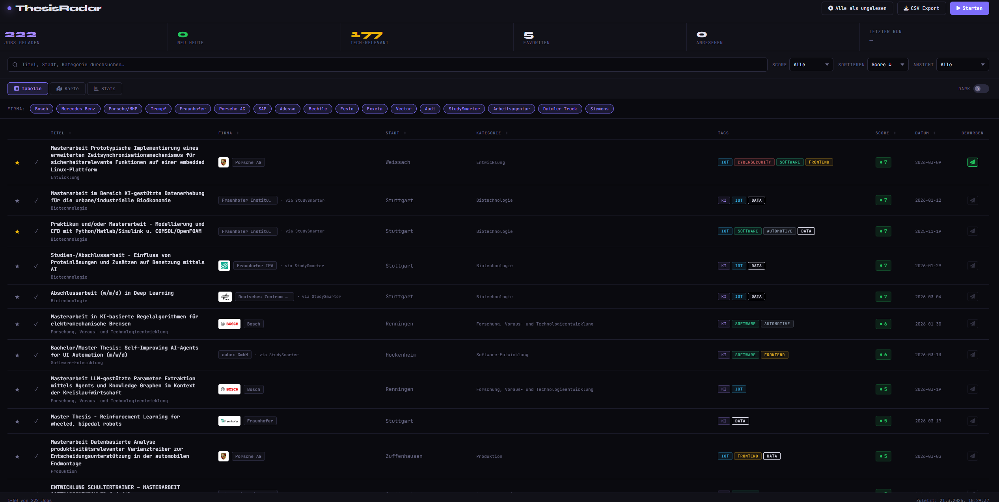
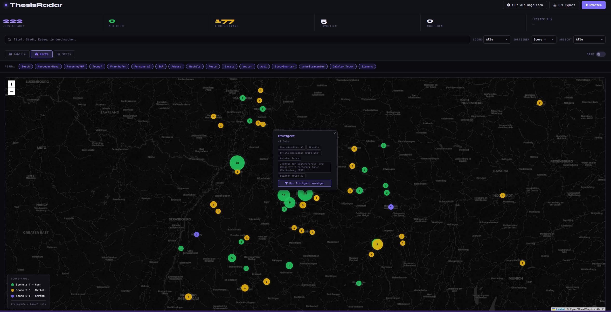
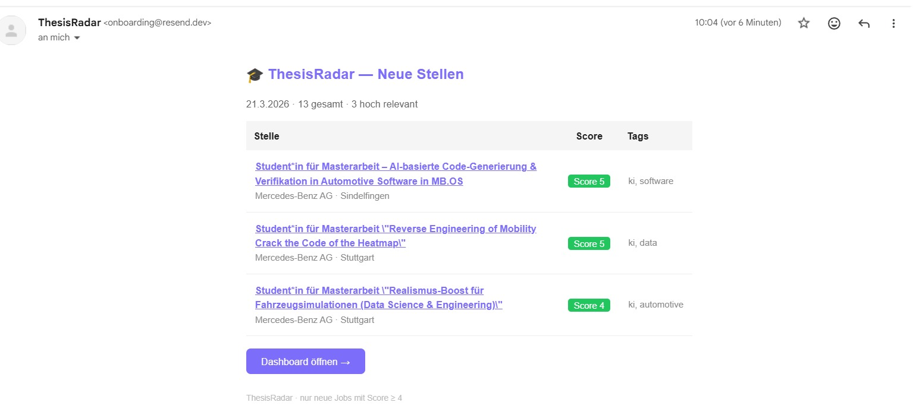
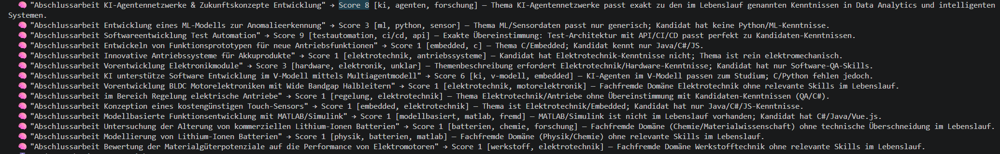
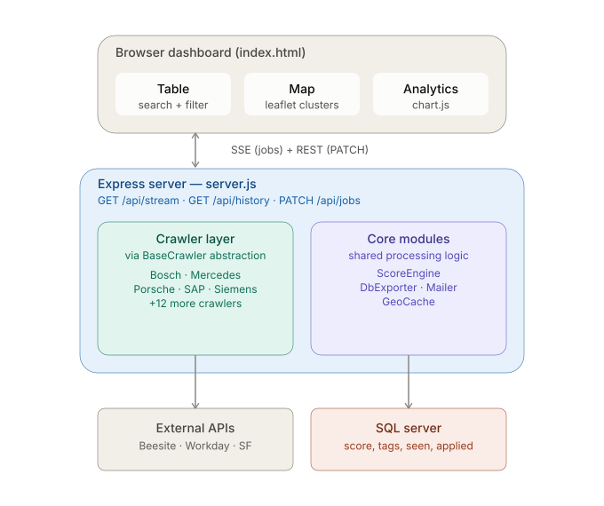

# ThesisRadar 🎓

> Smart Job Discovery & Analysis Tool for Thesis Positions — aggregating publicly available job listings into a structured, searchable dashboard with scoring and insights.

---

## ✨ Overview

ThesisRadar is a lightweight research tool designed to simplify the process of finding suitable thesis and internship positions.

Instead of manually browsing multiple career pages, the application aggregates publicly available job listings, evaluates them using a customizable scoring system, and presents them in an interactive dashboard.

The focus lies on **decision support**, not data collection!

---


## 🎯 Motivation

The German job market for tech graduates has become increasingly competitive. Finding the right thesis position — one that actually aligns with your skills and interests — requires monitoring dozens of career pages simultaneously, often daily.

ThesisRadar was built out of that necessity. Instead of spending 30+ minutes every morning clicking through career portals, the tool does it automatically and surfaces only what's actually relevant — scored, filtered, and ready to act on.

The goal is simple: **spend less time searching, more time applying to the right positions.**

---


> 📸 **Screenshot**





---

## 🔒 Why Crawlers Are Not Public

The concrete crawler implementations (`crawlers/*.js`) are excluded from this repository intentionally.

Each crawler contains company-specific API endpoints, request structures, and search parameters that were reverse-engineered from public career portals for personal use. Publishing them would:

- Potentially encourage bulk usage against company infrastructure
- Go beyond the intended personal research scope of this project
- Risk misuse by others for commercial or automated mass-scraping purposes
- Honest `User-Agent` header identifying the tool (`ThesisRadar-Crawler/1.0 (private thesis search)`) 
  — no browser impersonation
The **base abstractions** (`crawlers/base/`) are fully public — they contain all the reusable architecture. Adding a new crawler for any Beesite, Workday, or custom REST API takes less than 10 lines using the provided base classes.

---

## 🚀 Key Features

### 🔍 Job Discovery & Aggregation
- Aggregates publicly available job listings
- Supports various backend systems (REST APIs, Workday, SAP SuccessFactors)
- Automatic pagination and result normalization
- Deduplication via URL and ID — no duplicate entries
- Lightweight request strategy (~20 requests/day total)
- Per-crawler timeout (15s) and body size limit (5MB)
- Rolling date filter — only postings from the current year and the year before are kept (`core/DateFilter.js`); stale listings are dropped automatically, no hardcoded year to go stale itself

> The tool only accesses data that is also loaded during a normal browser session.

---

### 📊 Smart Scoring System
- **Two-stage scoring**: fast keyword prefilter decides tech-relevance, optional local LLM rescoring decides the actual fit
- Keyword-based scoring across 6 tech categories (AI, IoT, Security, Software, Frontend, Automotive)
- Visual score indicators: 🟢 high fit (≥4) · 🟡 medium (2–3) · 🔴 low (0–1)
- Fully customizable scoring logic in `core/ScoreEngine.js`

---

### 🧠 Resume-Based LLM Scoring (local via Ollama)
- Upload your CV as a PDF — parsed locally, never leaves your machine
- Every new, keyword-relevant job gets rescored against your actual resume by a **local** LLM (via [Ollama](https://ollama.com)) — no cloud API, no external calls
- Score reflects concrete, named skill overlap between the posting and your CV, not just generic "tech industry" vibes
- Automatic fallback to keyword scoring if Ollama is unreachable, times out, or returns malformed output — a crawl never breaks because of it
- "Starten" is disabled until a resume is uploaded, so you never accidentally run a crawl on pure keyword-guessing
- Full transparency: every LLM decision (score, tags, one-line reasoning) is logged to the console; `LLM_DEBUG=1` prints the raw model response for every job
- Configurable model/host/timeout via `.env` — defaults to `qwen3.5:9b`, tested on an RTX 3070 8GB

---

### 🎛️ Dynamic Keyword Scoring
- Set your own Stage-1 relevance keywords directly from the dashboard header — comma-separated, replaces the fixed 7-category system entirely once applied
- Strict allowlist of ~54 vetted tech terms (`core/KeywordStore.js`) — anything else is rejected with inline feedback naming the invalid terms, no free-text/junk categories reaching the scoring engine
- One-click reset back to the default 7-category system
- **"No filter" mode**: show every crawled job regardless of any keyword match, letting Stage 2 (LLM) — or your own eyes — be the only judge
- Persisted server-side (`data/keywords.json`) and takes effect on the next crawl

---

### 📄 Job Details Panel
- Click the **?** icon on any table row to slide in a details panel (50% width) from the right
- Shows the full job record: company, org, city, category, level, tags, score, dates
- Shows the full job description where the source API provides one (Bechtle, Vector, Stihl)
- Shows the LLM's one-line reasoning for the score, when Stage 2 ran for that job
- Persisted in the database (`description`/`reasoning` columns) — available after a page reload, not just during the live crawl that found it

---

### 🗄️ Data Management
- Live database connection badge in the header — pulsing green when SQL Server is reachable, red when not, rechecked every 30 seconds
- Delete individual job entries directly from the table (trash icon per row)
- "Alle löschen" button clears the entire table from the UI — no more manual `TRUNCATE TABLE` in SSMS
- Both actions ask for confirmation before executing

---

### 🖥️ Interactive Dashboard
- **Live updates** via Server-Sent Events (SSE) — jobs stream in one by one
- Real-time progress tracking per company with total / relevant / new counts
- Stats bar: jobs loaded, new today, tech-relevant, favorites, viewed, last run
- Dark / Light Mode with localStorage persistence

---

### 📋 Table View
- Full-text search across title, city, category, company (live, no submit)
- Filter by score, status (new / favorites / unread / applied), company chips
- Sortable columns: score, date, title
- Pagination (25 per page)
- Company logos, color-coded tech tags, new badge
- Per-job tracking: ★ Favorite · ✓ Viewed · ✈ Applied — all persisted in DB
- Auto-mark as viewed on link click
- "Reset all to unread" button

---

### 🗺️ Map View
- Interactive Leaflet.js map with dark CARTO theme
- Jobs clustered by city — marker size = job count, color = best score
- Popup with company overview and one-click city filter
- Score legend as native Leaflet control (bottom left)

---

### 📈 Analytics View
- Jobs per company (horizontal bar chart)
- Jobs per city (horizontal bar chart)
- Score distribution (vertical bar chart)
- Powered by Chart.js

---

### ⭐ Personal Tracking
- Favorites (★), Viewed (✓), Applied (✈) — all stored in SQL Server
- Optimistic UI updates with automatic rollback on DB failure
- CSV export with UTF-8 BOM (correct "umlauts" in Excel)

---

### 📧 Email Notifications
- Automatic email alert after each crawl run
- Only triggered when new jobs with **Score ≥ 4** are found
- Supports multiple recipients (e.g. Gmail + web.de simultaneously)
- HTML email with job table — title, company, city, score, tags
- Configurable via `.env` — no code changes needed
- Powered by [Resend](https://resend.com)

---

## 🧠 Use Cases

### Thesis Position Discovery
Identify relevant opportunities based on personalized scoring instead of manually browsing career pages daily.

### Decision Support
Compare companies, roles, and locations using structured, scored, and normalized data in one view.

### Geographic Analysis
Switch to map view to understand where jobs are geographically concentrated and filter by city.

### Market Insights
Use the analytics view to understand which skills and technologies are currently in demand across companies.

### Automated Job Alerts
After each scheduled crawl run, ThesisRadar automatically sends an email summary of all newly found high-score positions — so relevant opportunities are never missed without manual checking.

---

## 🏗️ Architecture



```

┌─────────────────────────────────────────────────────────────────┐
│                          Browser                                 │
│                        index.html                                │
│  ┌───────────┐  ┌──────────────┐  ┌──────────┐  ┌──────────┐  │
│  │  Table    │  │     Map      │  │  Stats   │  │  Filter  │  │
│  │ + Search  │  │  (Leaflet)   │  │(Chart.js)│  │  + Sort  │  │
│  └───────────┘  └──────────────┘  └──────────┘  └──────────┘  │
│              EventSource (SSE) + fetch (PATCH)                   │
└──────────────────────────┬──────────────────────────────────────┘
                           │ HTTP  127.0.0.1:3000  (local only)
┌──────────────────────────▼──────────────────────────────────────┐
│                     server.js  (Express)                         │
│                                                                  │
│  GET  /api/stream      SSE — live job streaming                 │
│  GET  /api/history     All jobs from DB                         │
│  GET  /api/companies   Active crawler list                      │
│  GET  /api/geocache    City coordinates                         │
│  GET  /api/db-status   Live DB connection check (badge)         │
│  PATCH /api/jobs/:id   Update seen / favorite / applied         │
│  DELETE /api/jobs/:id  Delete a single job                      │
│  DELETE /api/jobs      Delete ALL jobs (clear table)            │
│  GET  /api/resume      Resume upload status                     │
│  POST /api/resume      Upload + parse CV (PDF)                  │
│  DELETE /api/resume    Remove CV → back to pure keyword scoring │
│  GET  /api/keywords    Allowed + active custom keywords         │
│  POST /api/keywords    Set custom keywords (allowlist-checked)  │
│  PATCH /api/keywords   Toggle "no filter" mode                  │
│  DELETE /api/keywords  Clear custom keywords → 7 categories     │
│                                                                  │
│  ┌───────────────────────────────────────────────────────────┐  │
│  │                    Crawler Layer                          │  │
│  │  Bosch · Mercedes · Porsche · Trumpf · Fraunhofer · SAP  │  │
│  │  Siemens · Audi · Adesso · Bechtle · Festo               │  │
│  │  Exxeta · Vector · StudySmarter · Arbeitsagentur          │  │
│  │  · DaimlerTruck · MHP · Stihl (+18 total)              │  │
│  └──────────────────────┬────────────────────────────────────┘  │
│                         │  extends                               │
│  ┌──────────────────────▼────────────────────────────────────┐  │
│  │               Base Abstractions                            │  │
│  │  BaseCrawler ──► BeesiteCrawler ──► MercedesCrawler       │  │
│  │              └──► WorkdayCrawler ──► TrumpfCrawler        │  │
│  └──────────────────────┬────────────────────────────────────┘  │
│                         │                                        │
│  ┌──────────────────────▼────────────────────────────────────┐  │
│  │                     Core Modules                           │  │
│  │  ScoreEngine · LlmScoreEngine · KeywordStore · DateFilter  │  │
│  │  ResumeStore · DbExporter · CsvExporter · GeoCache · Mailer │  │
│  └──────────────────────┬────────────────────────────┬────────┘  │
└─────────────────────────┼─────────────────────────────┼───────────┘
                          │                             │ HTTP 127.0.0.1:11434
┌─────────────────────────▼────────────────────────┐   ┌▼──────────────────────┐
│   SQL Server  (local, Windows Authentication)     │   │  Ollama (local LLM)   │
│   jobs: title · company · city · url · score ·    │   │  qwen3.5:9b — runs     │
│         tags · seen · favorite · applied ·        │   │  entirely on your GPU  │
│         applied_at · created_at                   │   │  (no cloud API)        │
└────────────────────────────────────────────────────┘   └────────────────────────┘
                          │
┌─────────────────────────▼────────────────────────────────────────┐
│            External Career APIs  (HTTPS, outbound only)           │
│   Beesite REST · Workday REST · SAP SuccessFactors                │
└───────────────────────────────────────────────────────────────────┘
```

`data/resume.txt` (the parsed CV text) stays local — it is only ever read by `LlmScoreEngine.js` and sent to the loopback Ollama endpoint above, never to the crawlers or any external API.

### Crawl Data Flow

```
User clicks "Start"
    │
    ├─► GET /api/stream          opens SSE connection
    │
    └─► Server iterates CRAWLERS[]
            │
            ├─► send('status', loading)   →  progress bar appears
            ├─► crawler.fetchAll()        →  external API call
            ├─► date filter (current year + prior year only)
            ├─► keyword scoring + dedup
            │
            ├─► for each new job:
            │       IF resume uploaded → llmScoreJob() rescores via Ollama
            │           (falls back to keyword score on timeout/error)
            │       sleep(800ms)
            │       send('job', {...})    →  row appears in table
            │
            └─► send('status', done)      →  bar turns green

        after all crawlers:
            ├─► insertJobs(allNew)        →  persist to SQL Server
            ├─► geocodeAllCities()        →  cache coordinates
            ├─► sendJobAlert(allNew)      →  email if new & score ≥ 4
            └─► send('done')             →  button re-enabled
```

---

## ⚙️ Tech Stack

### Backend
| Technology | Purpose |
|------------|---------|
| Node.js ≥ 18 | Runtime |
| Express.js | HTTP server, REST API |
| mssql / msnodesqlv8 | SQL Server connector (Windows Auth) |
| dotenv | Environment configuration |
| Resend | Email notifications |
| [Ollama](https://ollama.com) | Local LLM runtime — resume-based scoring, no cloud API |
| multer | PDF upload handling (memory storage, 10MB limit) |
| pdf-parse | Extracts text from the uploaded CV |

### Frontend
| Technology | Purpose |
|------------|---------|
| Vanilla JS (ES2022) | All frontend logic — no framework |
| Leaflet.js 1.9.4 | Interactive map |
| Chart.js 4.4.1 | Analytics charts |
| Font Awesome 6.5 | Icons |
| SSE (EventSource) | Live job streaming |

---

## ⚙️ Configuration

all dependencies can be looked up inside the package json file

**`.env`** in project root:
```env
PORT=3000
DB_DRIVER=ODBC Driver 17 for SQL Server
DB_SERVER=localhost\SQLEXPRESS
DB_NAME=ThesisRadar

# Email notifications (Resend)
RESEND_API_KEY=re_xxxxxxxxxxxxxxxxxxxxxxxx
MAIL_TO=your@gmail.com,your@web.de

# LLM-Rescoring (core/LlmScoreEngine.js) — only active once a resume is uploaded
OLLAMA_URL=http://localhost:11434
OLLAMA_MODEL=qwen3.5:9b
OLLAMA_TIMEOUT_MS=45000
LLM_DEBUG=0          # set to 1 to log the raw model response for every job
```

---

## 🧠 Local LLM Setup (Ollama)

Resume-based scoring is fully optional and runs entirely on your own machine — no API key, no cloud
service, no data leaving your PC. Here's how to get it running.

### 1. Install Ollama

Download the installer for your OS from **[ollama.com/download](https://ollama.com/download)** and run it.

On Windows you can alternatively install it via winget:
```powershell
winget install Ollama.Ollama
```

This installs the `ollama` CLI and a background service listening on `http://localhost:11434`.

### 2. Pull a model

```powershell
ollama pull qwen3.5:9b
```

`qwen3.5:9b` is the default model this project is configured for and was tested on an **RTX 3070 (8GB
VRAM)** — it fits comfortably in 4-bit quantization with headroom to spare. As a rule of thumb for 8GB
cards: stick to 7-9B models. Once the pull finishes, `ollama run qwen3.5:9b` drops you into an interactive
chat — that's just a convenience REPL, `Ctrl+D` to exit. It also confirms the background service is
reachable.

### 3. Verify it's reachable

```powershell
curl http://localhost:11434/api/tags
```

Should return JSON listing your pulled models. If this fails, the Ollama service isn't running — check
Windows Services / Task Manager, or just run `ollama serve` manually.

### 4. Configure `.env` (optional — defaults already match)

```env
OLLAMA_URL=http://localhost:11434
OLLAMA_MODEL=qwen3.5:9b
OLLAMA_TIMEOUT_MS=45000
```

Swap `OLLAMA_MODEL` for any other pulled model (e.g. a larger `qwen3.5:32b` if you have the VRAM, or a
smaller `qwen3.5:3b` for faster/weaker hardware). `OLLAMA_TIMEOUT_MS` needs to be generous enough for a **cold
model load** — the first call after starting Ollama has to load the full model into VRAM, which can take
20-30s even on a fast GPU; every call after that is typically sub-second.

### 5. Upload your resume

Start the app (`node server.js`), open the dashboard, click **"Lebenslauf"** in the header, and upload your
CV as a PDF. The "Starten" button stays disabled until this is done — once uploaded, every future crawl
rescores new jobs against it automatically (`core/LlmScoreEngine.js`).

### How the fallback works

If Ollama isn't running, times out, or returns something the app can't parse, the affected job silently
keeps its Stage 1 keyword score instead — logged as a `⚠ Fallback auf Keyword-Score` warning in the
console. A crawl never fails because of the LLM step.

### Debugging bad scores

Every LLM decision is logged: `🧠 "<title>" → Score X [tags] — reasoning`. If a score looks wrong, check
that line first. For the full raw model response on every job (useful when tuning the prompt in
`core/LlmScoreEngine.js`), set `LLM_DEBUG=1` in `.env`.

---

## 🗄️ Database Schema

```sql
CREATE TABLE jobs (
    id          INT IDENTITY(1,1) PRIMARY KEY,
    title       NVARCHAR(500)  NOT NULL,
    company     NVARCHAR(200),
    source      NVARCHAR(100),
    city        NVARCHAR(200),
    url         NVARCHAR(500)  UNIQUE,
    date        NVARCHAR(50),
    startDate   NVARCHAR(50),
    score       INT            DEFAULT 0,
    tags        NVARCHAR(MAX),         -- JSON array e.g. ["ki","software"]
    logo        NVARCHAR(500),
    org         NVARCHAR(200),
    level       NVARCHAR(100),
    category    NVARCHAR(200),
    description NVARCHAR(MAX)  NULL,     -- full job text, only where the source API provides it
    reasoning   NVARCHAR(500)  NULL,     -- one-line LLM rationale for the score (core/LlmScoreEngine.js)
    seen        BIT            DEFAULT 0,
    favorite    BIT            DEFAULT 0,
    applied     BIT            DEFAULT 0,
    applied_at  DATETIME       NULL,
    created_at  DATETIME       DEFAULT GETDATE()
);
```

`description` and `reasoning` are added automatically on startup via an idempotent migration in `core/DbExporter.js` — no manual `ALTER TABLE` needed even on an existing database.

---

## 📁 Project Structure

```
thesis-radar/
├── index.html                   ← Single Page App (dashboard)
├── server.js                    ← Express + SSE + REST API
├── daily_crawler.js             ← Terminal-only crawler (no GUI)
├── .env                         ← Secrets — do NOT commit
├── package.json
│
├── core/
│   ├── ScoreEngine.js           ← Keyword scoring logic (3 Stage-1 modes)
│   ├── LlmScoreEngine.js        ← Ollama call — resume-based rescoring + fallback
│   ├── KeywordStore.js          ← Custom keyword allowlist + "no filter" mode
│   ├── DateFilter.js            ← Rolling current-year/prior-year posting filter
│   ├── ResumeStore.js           ← PDF parsing, save/load data/resume.txt
│   ├── CsvExporter.js           ← CSV read/write with BOM
│   ├── DbExporter.js            ← SQL Server: connect/insert/load/update/delete/checkConnection
│   ├── GeoCache.js              ← City coordinate caching
│   └── Mailer.js                ← Email notifications (Resend)
│
├── data/
│   ├── resume.txt               ← Parsed CV text (gitignored, personal data)
│   └── keywords.json            ← Custom keyword config (gitignored, local preference)
│
├── crawlers/
│   ├── base/
│   │   ├── BaseCrawler.js       ← httpGet/Post, timeout, maxBody, dedup
│   │   ├── BeesiteCrawler.js    ← abstract: Beesite POST + GET
│   │   └── WorkdayCrawler.js    ← abstract: Workday POST
│   │
│   ├── BoschCrawler.js
│   ├── MercedesCrawler.js       
│   ├── PorscheCrawler.js        
│   ├── TrumpfCrawler.js         
│   ├── FraunhoferCrawler.js     
│   ├── StihlCrawler.js          ← full jobDescription available, no HTML scraping needed
│   └── ... 12 more
│
├── assets/logos/                ← Company logos (PNG/SVG)

```

---


## 📊 Scoring System

Scoring happens in two stages:

### Stage 1 — Keyword prefilter (always runs, `core/ScoreEngine.js`)
Cheap, instant, decides whether a job is tech-relevant at all before it's ever shown or rescored. Runs in one of three modes, checked in this order:

**1. Filter disabled** (`core/KeywordStore.js`, toggled via the "no filter" checkbox in the header) — every job is treated as relevant, unconditionally. Use this if you'd rather let Stage 2 (LLM) or your own eyes do all the judging.

**2. Custom keywords set** (typed into the header input, comma-separated) — replaces the 7-category system entirely. Each job is checked against your list; only terms from a fixed ~54-word allowlist are accepted, anything else is rejected with feedback naming the invalid term(s). Score = 2 points per matched keyword (capped at 10).

**3. Default — the 7 fixed categories** (used when nothing above applies):

| Category | Example Keywords | Score |
|----------|-----------------|-------|
| AI / ML | ai, machine learning, llm, nlp, neural | **+3** |
| IoT | iot, industrie 4.0, sensor, edge, embedded | **+2** |
| Cybersecurity | security, cyber, pentest | **+2** |
| Software | cloud, devops, kubernetes, docker | **+2** |
| Frontend | react, vue, angular, javascript | **+1** |
| Automotive | adas, autosar, batterie, elektro | **+1** |

Fully customizable in `core/ScoreEngine.js`. Whichever mode is active, changes take effect on the **next crawl** — not retroactively on jobs already in the table.

### Stage 2 — LLM rescoring (optional, `core/LlmScoreEngine.js`)
If a resume is uploaded, every job that survived Stage 1 gets rescored by a local LLM against the actual CV
content — title, category, org and level are sent, the LLM returns a 0-10 score, 1-3 tags and a one-line
reasoning. This replaces the generic keyword score with a personalized one. See [🧠 Local LLM Setup](#-local-llm-setup-ollama) below.

If Stage 2 is skipped (no resume) or fails (Ollama down/timeout/bad output), the Stage 1 keyword score is used as-is — Stage 2 never blocks a crawl.

---

## ⏰ Automation

**Windows Task Scheduler** for daily automated run:
```
Program:    node
Arguments:  C:\path\to\thesis-radar\daily_crawler.js
Start in:   C:\path\to\thesis-radar
Trigger:    Daily, 08:00
```

---

## 🔐 Security

- Server binds exclusively to **`127.0.0.1:3000`** — not reachable from the network
- `.env` file never committed to version control
- All database queries use **parameterized statements** — no SQL injection risk
- 5MB response body limit + 15s timeout in all crawlers
- No authentication required — purely local tool
- **Resume handling**: uploaded PDF is parsed in-memory, the extracted text is written only to
  `data/resume.txt` (gitignored) and sent only to the local Ollama endpoint (`127.0.0.1:11434`) — it is
  never stored in the database, never included in email alerts, and never sent to any crawler or external API
- Only PDF uploads are accepted (`multer` + MIME-type check), capped at 10MB
- **Destructive endpoints** (`DELETE /api/jobs`, `DELETE /api/jobs/:id`) are only reachable from the local dashboard and always require a confirmation dialog client-side before firing — but since there's no auth, anything with network access to `127.0.0.1:3000` (i.e. only your own machine) could call them directly

---

## ⚖️ Legal & Compliance

This project is intended solely for personal research and job discovery purposes.

- Only **publicly accessible data** is processed — no login bypass
- The only personal data the tool handles is your own, voluntarily uploaded resume (for local LLM scoring)
  — it stays on your machine and is never transmitted anywhere except to your own local Ollama instance
- **No technical safeguards** (CAPTCHA, login systems) are bypassed → § 202a StGB not applicable
- Requests are performed at very low frequency, comparable to normal browsing behavior
- No data is redistributed, published, or commercialized

> ⚠️ Individual website terms may restrict automated access. This project is not affiliated with any referenced companies. Usage is at your own responsibility.

---

## 🌱 Ethical Considerations

This project follows a minimal-impact approach:

- Low request volume with deliberate rate limiting
- No exploitation or bulk extraction of data
- No commercial usage of any kind
- Goal: support individual decision-making, not large-scale data collection

---

## ⚠️ Limitations

Honest gaps, not hidden ones:

- **Thin crawl data for most companies** — only Bechtle, Vector, and Stihl expose a full job description via their APIs. The other 15 crawlers only ever see title/category/org, so Stage 2 LLM scoring for those companies is working from a title alone, which caps how accurate it can be no matter how well the prompt is tuned.
- **Local LLM quality varies by model** — scoring accuracy depends entirely on whichever Ollama model is configured. Smaller/quantized models can still misjudge edge cases (e.g. vague catch-all postings) even with a calibrated prompt; the automatic fallback only triggers on technical failures (timeout, malformed JSON), not on a confidently wrong answer.
- **Single-user, single-resume, single-machine** — no authentication, no multi-user support, no cloud sync. Built to run on one person's PC against their own local SQL Server/LocalDB instance.
- **Crawlers are brittle by nature** — each one depends on a specific company's undocumented API shape or HTML structure. When a company redesigns their careers page, the crawler can silently start returning 0 results with no automatic alert — only caught by noticing the count looks off.
- **The keyword relevance filter is a hard binary gate** — whichever Stage-1 mode is active (7 categories, custom keywords, or disabled), a job that doesn't pass it never reaches Stage 2. The LLM never gets a chance to "rescue" a job the filter rejected, unless "no filter" mode is explicitly enabled.
- **Date filter depends on clean crawler output** — the rolling current-year/prior-year filter trusts each crawler's `date` field to be a parseable date string. A crawler that leaves it blank or malformed will have every one of its jobs silently filtered out.
- **No automated tests** — verification has been manual (live crawls, spot-checking LLM scores, curl-testing endpoints). There's no test suite to catch regressions.
- **Windows-centric** — the DB layer (`msnodesqlv8`, ODBC Driver 17, LocalDB) assumes Windows; porting to macOS/Linux would mean swapping the SQL Server connector for something like `pg` or `sqlite3`.

---

## 💡 Potential Improvements

- Fetch full job descriptions for the remaining crawlers where the source API/detail page provides them
  (Bechtle, Vector and Stihl already pass a real `description` to the LLM — most others only capture
  title/category/org and would need an extra per-job request)
- Batch rescoring of the full job history against a newly uploaded resume, instead of only new jobs going forward
- Deadline tracking per job (manual date input with visual warning)
- Keyboard shortcuts for faster job triage (`F` favorite, `S` seen, `A` applied)
- Distance filter on map ("jobs within 50km of my location")
---

## 📌 Status

Active personal project — continuously extended with new data sources and features.

---

